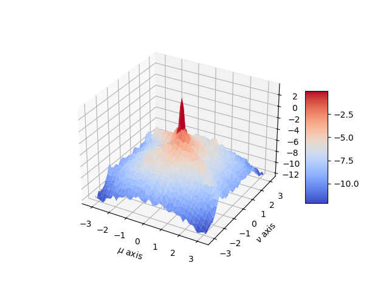

## Power Spectral Density of an Image

Read and analyze the gray scale image `img04g.tif`.

### Grayscale Input Image


### Power Density 64 x 64


### Power Density 128 x 128


### Power Density 256 x 256


### Improved Power Density



### Code

```py
def BetterSpecAnal(x: np.array, win_size: int, num_win_per_side: int, output_image_path: str):
    x = np.double(x)/255.0
    
    # Get central windows
    center_x = x.shape[0] // 2
    center_y = x.shape[1] // 2
    start_x = center_x - (num_win_per_side // 2) * win_size
    start_y = center_y - (num_win_per_side // 2) * win_size
    windows = [x[i:i+win_size, j:j+win_size] for i in range(start_x, start_x+num_win_per_side*win_size, win_size)
                                                for j in range(start_y, start_y+num_win_per_side*win_size, win_size)]
    
    # Create 2-D separable Hamming window
    hamming_window = np.outer(np.hamming(win_size), np.hamming(win_size))
    
    # Initialize power spectral density array
    psd_sum = np.zeros((win_size, win_size))
    
    # Compute squared DFT magnitude for each window
    for window in windows:
        window = window * hamming_window
        dft = np.fft.fftshift(np.fft.fft2(window))
        psd_sum += np.abs(dft)**2
        
    # Average power spectral density across windows
    psd_avg = psd_sum / (len(windows) * win_size)

    # Plot the result using a 3-D mesh plot and label the x and y axes properly.
    fig = plt.figure()
    ax = fig.add_subplot(111, projection='3d')
    a = b = np.linspace(-np.pi, np.pi, num = win_size)
    X, Y = np.meshgrid(a, b)
    surf = ax.plot_surface(X, Y, np.log(psd_avg), cmap=plt.cm.coolwarm)

    ax.set_xlabel('$\mu$ axis')
    ax.set_ylabel('$\\nu$ axis')
    ax.set_zlabel('Z Label')

    fig.colorbar(surf, shrink=0.5, aspect=5)
    fig.savefig(output_image_path)
```